# Table of Contents

1.  [Who is your lecturer?](#org300a0ff)
2.  [My first programming languages](#orgada5e5d)
3.  [Why Python? Why not?](#orgadaae42)
4.  [Natural vs. programming languages](#orgaa0afa9)
5.  [The importance of (understanding) infrastructure](#org67538f4)
6.  [What do you expect from this course?](#org24e5d14)
7.  [What careers do our students have?](#org41ab24c)
8.  [What will you do in this course?](#orgcc08377)
9.  [How will you be evaluated?](#orgd16ffee)
10. [Which tools are we going to use?](#orga56ccbc)
11. [The Canvas LMS](#org4d5362c)
12. [The GitHub platform](#org4030d3d)
13. [IDLE (Integrated Devevelopment Learning Environment](#org7b28fe2)
14. [Google Colaboratory IPython Notebooks](#orgf9f53b5)
15. [replit.com REPL + console + templates](#org3d8b59d)
16. [DataCamp lessons + projects + workspace](#org8f5acec)
17. [Can we use AI coding assistants?](#orgb329dc0)
18. [When are the first assignments due?](#orgc3b107f)
19. [Will you need to buy any books for this course?](#org43af146)
20. [Infinite skills](#orgeb364aa)
21. [Next / Any questions? / Review questions](#orgf54fcd1)
22. [Practice: Python scripting infrastructure](#orga2bdafb)
23. [Glossary](#orgf0158f0)
24. [References](#org1771681)

# Who is your lecturer?

-   Monty Python used to be one of my favorite shows:
    1.  British humor (I went to school in London)
    2.  Anarchic and irreverent (I was young once)
    3.  MUDs (First online programming class)<a id="fnr.1" class="footref" href="#fn.1" role="doc-backlink">1</a>

# My first programming languages

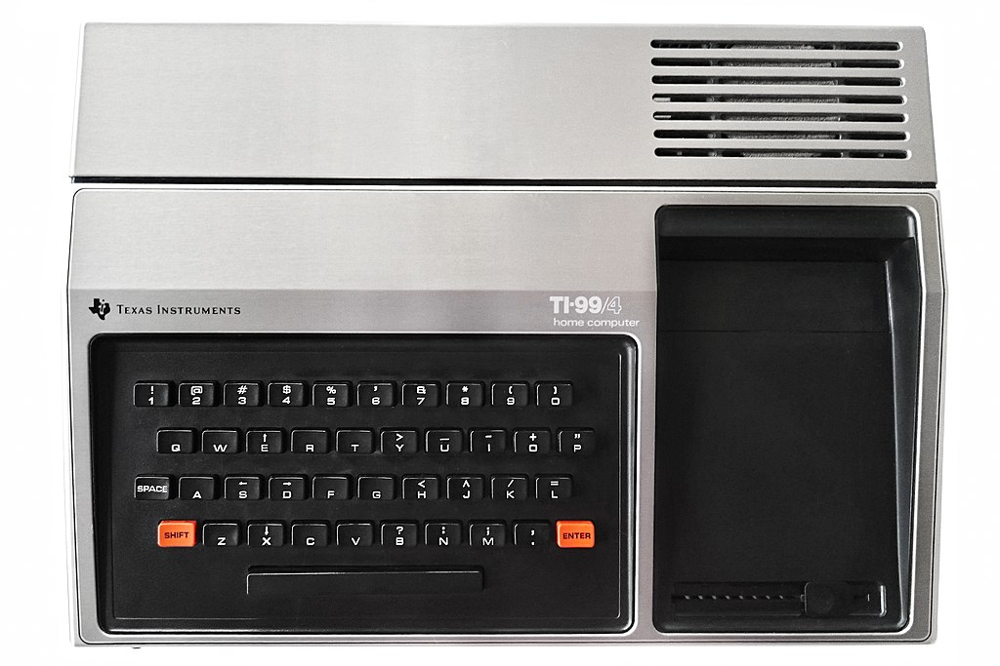

-   My first programming languages:
    1.  BASIC - Beginner's All-purpose Symbolic Instruction Code (1979)
    2.  FORTRAN - FORMula TRANslator (1985)
    3.  C++ (1989)

-   How many programming languages are there today?

# Why Python? Why not?

")

-   WHY PYTHON?<a id="fnr.2" class="footref" href="#fn.2" role="doc-backlink">2</a>
    
    > 1.  Readability and simplicity `**`
    > 2.  Versatility and applicability `**`
    > 3.  Large and active community
    > 4.  Cross-platform compatibility
    > 5.  Abundance of libraries and frameworks `*`
    > 6.  Data science and machine learning `***`
    > 7.  Automation and scripting `***`
    > 8.  Career opportunities `*`

-   WHY NOT PYTHON?
    
    > 1.  Specific platform requirements `**`
    > 2.  Performance-critical applications `***`
    > 3.  One-paradigm language (cp. R, Haskell, C/C++, SQL) `**`
    > 4.  Industry demand `*`
    > 5.  You might just not like significant indentation `*`

# Natural vs. programming languages

-   C/C++ is like Latin
    
    

-   SQL is like English
    
    

-   Lisp is like French
    
    

-   R is like Italian
    
    

-   Snap! is like Russian
    
    

-   FORTRAN is like Hebrew
    
    

-   HTML is like Gaelic
    
    

-   Python is like Spanish
    
    

# The importance of (understanding) infrastructure

Some infrastructure that separates you from just "getting on" with it:

1.  Network server / network
2.  Keyboard / Screen
3.  Operating system (OS)
4.  OS shell / terminal / console
5.  Python shell / console
6.  File system
7.  Compiler/interpreter
8.  Editor
9.  Middleware and meta data
10. Graphical user interface

(Most of these infrastructure components are written in C/C++.)

# What do you expect from this course?

See also responses in the [Google Forms survey](https://docs.google.com/forms/d/1YItHX4fru4TiNvmzJQDh-DG9t2C69dLQNWw0uIc_vmE/edit#responses).

What's your single most important personal goal?

# What careers do our students have?

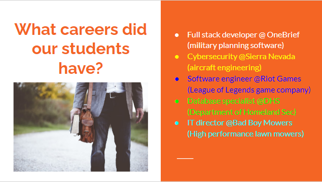

# What will you do in this course?

 with AgNav system (Flickr.com)")

-   **Part 1: Basics**
    1.  Input and Output
    2.  Flow control
    3.  Functions
    4.  Lists and dictionaries

-   **Part 2: Applications**
    1.  Strings and regular expressions
    2.  Webscraping and file manipulation
    3.  Working and visualizing tabular data
    4.  Machine learning: spam filter

-   **Part 3: Capstone Project**, e.g.
    1.  [Program the Finch 2.0 robot (microbit) with Python](https://learn.birdbraintechnologies.com/slpage/python-installation-for-finch/) - move / draw.
    2.  Setup and demonstrate machine learning on [Google Coral Edge TPU.](https://coral.ai/docs/accelerator/get-started/)
    3.  [Set my databot 2.0 up](https://databot.us.com/setup/) - extract data and visualize with Python.
    4.  Set up and program my [Mycroft MKII](https://mycroft.ai/) (open source voice assistant)
    5.  Identify your own research problem and use Python to solve it
    6.  Program another 2D or 3D game in Python (e.g. with PyGame, using
        any of Sweigart's games [in his 2016 book](https://inventwithpython.com/invent4thed/), or with Turtle).
    7.  Analyse and demo use of any of our course tools in your field of
        interest or expertise (GitHub, DataCamp, Colab, CLI or
        AI). E.g. complete and document (in Colab) an unguided DataCamp
        Python [project](https://www.datacamp.com/blog/introducing-unguided-projects-the-worlds-first-interactive-code-along-exercises) (link to [unguided relevant Python projects](https://app.datacamp.com/learn/projects?technologies=Python&hasUnguided=true&sort=relevance)).
    8.  Create a literature (and practice) overview of Python in your
        field of professional or personal interest.
    9.  Something completely different related to introduction to
        programming (not necessarily with Python).
    10. Take a topic from my GitHub issues list: [birkenkrahe/py/issues](https://github.com/birkenkrahe/py/issues).

# How will you be evaluated?

")

-   All course requirements have deadlines (strict)
-   Late submissions will be penalized (loss of points)
-   No final exam but 4 weekly tests (graded)
-   DataCamp/programming assignments are home assignments
-   In-class practices are "literate programming" exercises
-   You are expected to code along using Google Colab and/or IDLE

# Which tools are we going to use?

1.  [Canvas](https://lyon.instructure.com/) (learning management system)

2.  [GitHub repository](https://github.com/birkenkrahe/py) (all course materials except tests)

3.  [Google Colaboratory](https://colab.research.google.com) (online interative notebook / Literate IDE)

4.  [Command line interface](https://replit.com) interpreter - (shell / REPL at replit.com)

5.  [Python Interactive Development Learning Environment](https://youtu.be/WIlQukiXs-E) (IDLE)

6.  [DataCamp](https://datacamp.com/) (data science online learning for Python, R, SQL)

7.  AI ([OpenAI ChatGPT](https://chat.openai.com/chat), [Google Bard](https://bard.google.com/u/1/), [GitHub CoPilot](https://github.com/github-copilot/free_signup) w/editor)

ANY OF THESE TOOLS CAN BE THE BASIS OF YOUR COURSE PROJECT!

# The Canvas LMS

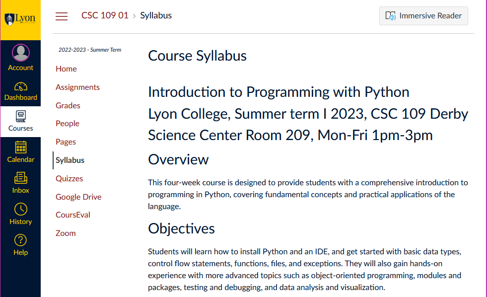 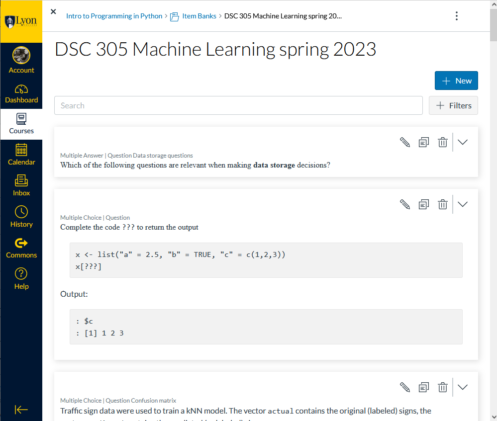

-   Course announcements (notifications via email)
-   Assignments for submission and online tests
-   Zoom links (participate remotely/cloud recording)
-   Course links (GitHub, GDrive Whiteboard, DataCamp invite link)
-   Gradebook (weekly updates)

# The GitHub platform

") ")

-   [GitHub](https://github.com/birkenkrahe) is the most popular software development platform.
-   The 'Git' in the name is a version control software by Torvalds
-   It also contains Gists (code snippets), Issues, and CoPilot (AI)
-   Here for you: all course materials, and the general course FAQ
-   No registration required but recommended (watch/fork/collaborate)

# IDLE (Integrated Devevelopment Learning Environment

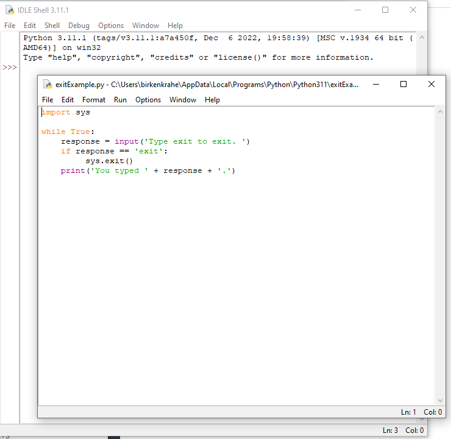 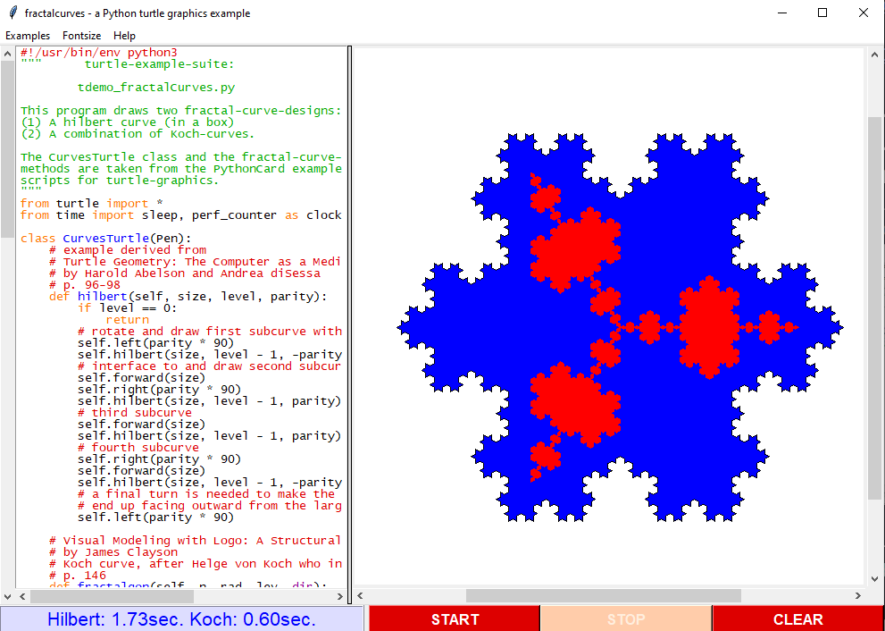

-   Built-in Python shell for interactive experimentation
-   Includes file editor and "Turtle" graphics
-   Local and private to your computer
-   No registration required

**More information**:

-   Video: [What is Python IDLE and How to Use the IDLE Shell](https://youtu.be/WIlQukiXs-E) (6')
-   Tutorial: [Getting Started with Python IDLE](https://realpython.com/python-idle/) + [video lessons](https://realpython.com/courses/starting-python-idle/) (25')
-   Interactive Shell also available as [Google Chrome extension](https://chrome.google.com/webstore/detail/python-shell/gdiimmpmdoofmahingpgabiikimjgcia?hl=en)

# Google Colaboratory IPython Notebooks

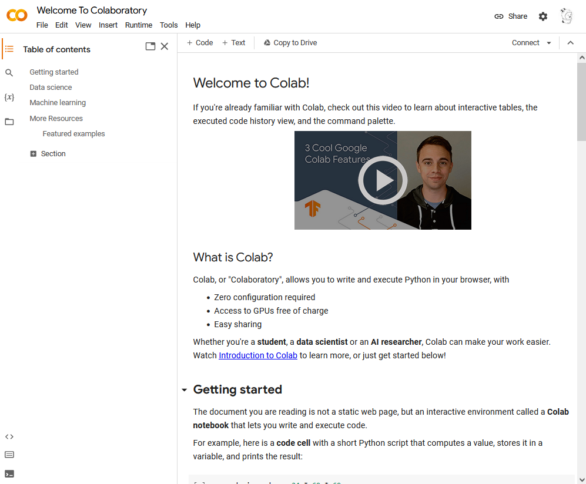 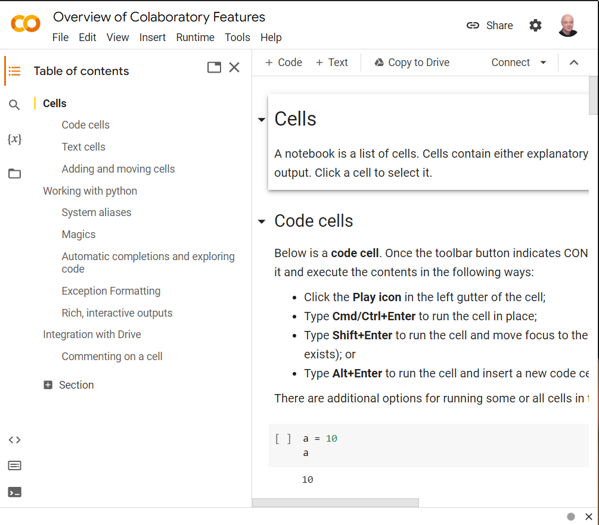 

-   Free interactive (literate) notebook: text + code + output
-   Upload to Lyon GDrive and/or GitHub/Gist
-   Linux Docker container (virtual OS)
-   Access to shell only with upgrade
-   Primary collaborative tool in this course
-   Registration required to save your notebooks for submission
-   Online alternative to Emacs + Org-mode or VS Code cloud (vscode.dev)

# replit.com REPL + console + templates

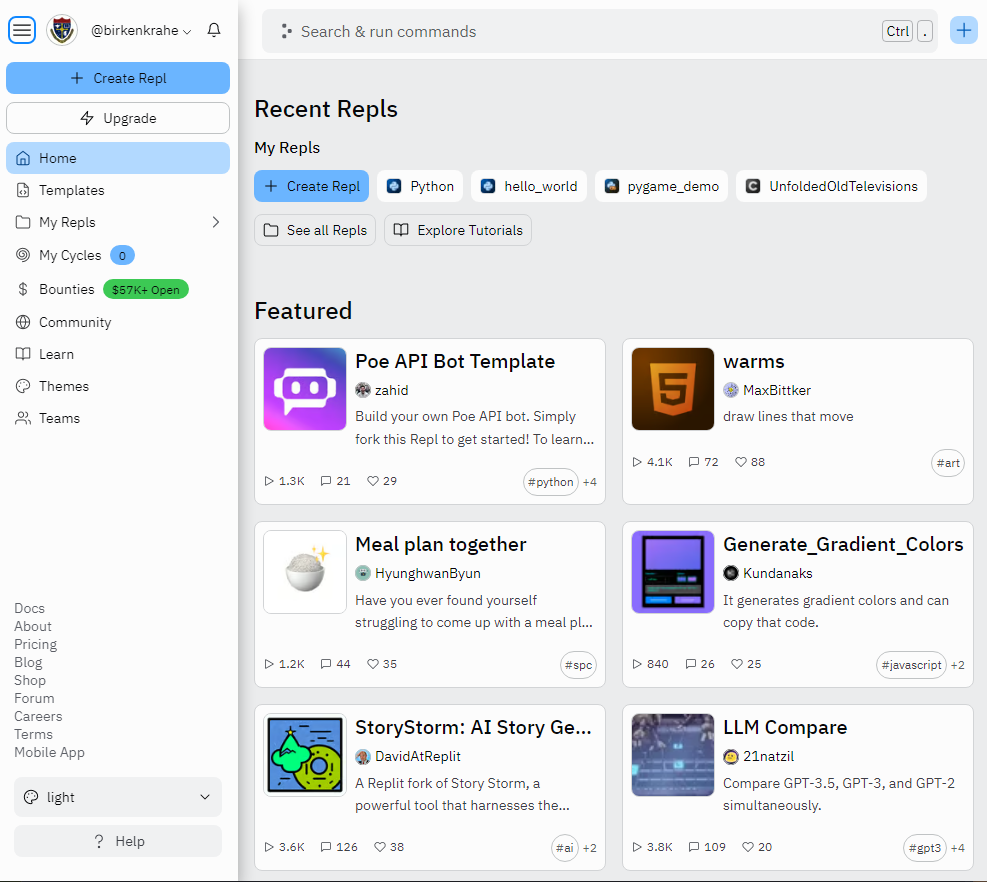 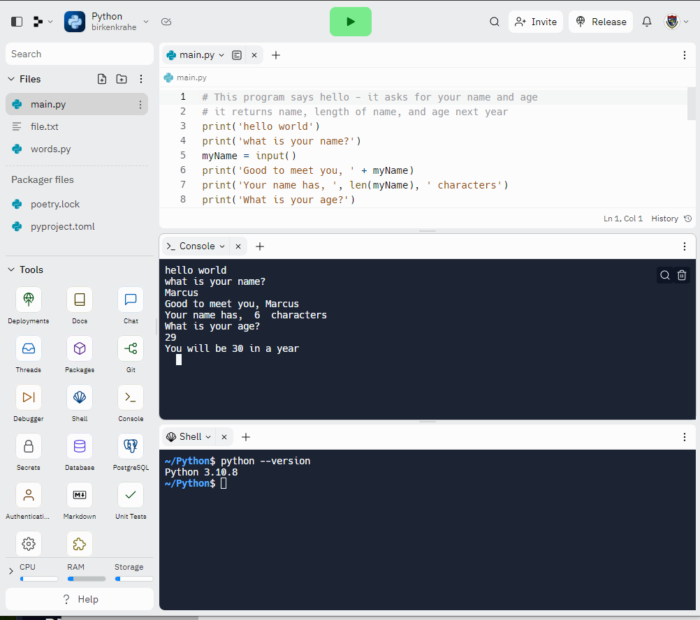

-   Free REPL (Read-Eval-Print-Loop) + Python console + Shell
-   Templates for many programming languages to choose from
-   Cool data science and AI project templates
-   Easy to share code publicly
-   Alternative to IDLE (though can be slow to respond at times)
-   Registration required to create your own REPL

# DataCamp lessons + projects + workspace

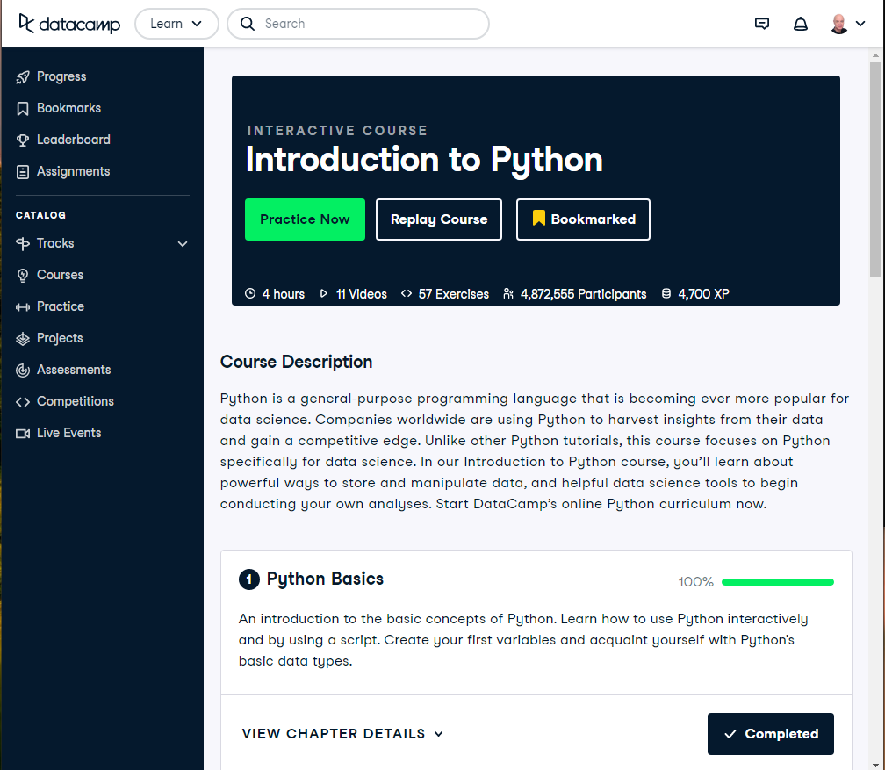 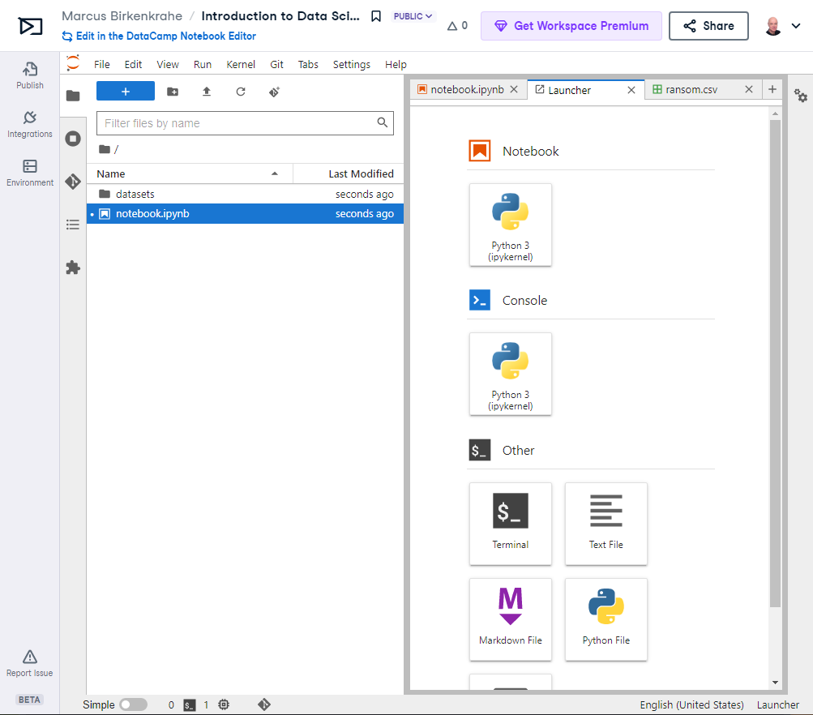

**DataCamp:**

-   Free online data science learning platform (Python, R, SQL)
-   Each course is 3-4 hours long and leads to a certificate
-   Many guided and unguided projects (ca 1 hour per project)
-   Mobile app and practice exercises for each course
-   Jupyter Lab available as part of DataCamp workspaces
-   Registration **with Lyon email** required

**Alternatives worth checking out (first course is free):**

-   freeCodeCamp.org, esp. [Harvard's CS50](https://youtu.be/nLRL_NcnK-4) (video and tutorials only)
-   [dataquest.io](https://www.dataquest.io/path/introduction-to-python-programming-skill/) (looked at the first lesson - more demanding)
-   [codeacademy.com](https://www.codecademy.com/learn/learn-python-3) (very beginner friendly, programmer-focused)
-   [w3schools.com](https://www.w3schools.com/python/python_intro.asp) (low entry, nice integrated workspace)

# Can we use AI coding assistants?

")

-   Yes, you may as long as you document it meticulously and diligently
-   I frequently use [OpenAI ChatGPT](https://chat.openai.com/chat), and I tried [Google Bard](https://bard.google.com/u/1/)
-   [GitHub CoPilot](https://github.com/github-copilot/free_signup) only works as an editor extension (haven't tried it)
-   Google Colab will soon introduce [Google Codey](https://blog.google/technology/developers/google-colab-ai-coding-features/)
-   AI assistance will take lots of time if you use them well

My typical workflow looks like this:

1.  My question: "How can I get &pi; in Python?"
2.  ChatGPT spits out explanation with code snippet
3.  I check the text and the code
4.  I create an exercise or two around the question
5.  If I received chatbot help, I reference the software

")

# When are the first assignments due?

")

-   The first home assignment, first test and in-class assignments are
    due a week from now, on Monday, 28 May, by 12 pm (so that I can
    check 'em).

-   All DataCamp assignments are due by Friday, June 23rd (so that I can
    grade them): Three courses to be completed in your own time.

# Will you need to buy any books for this course?

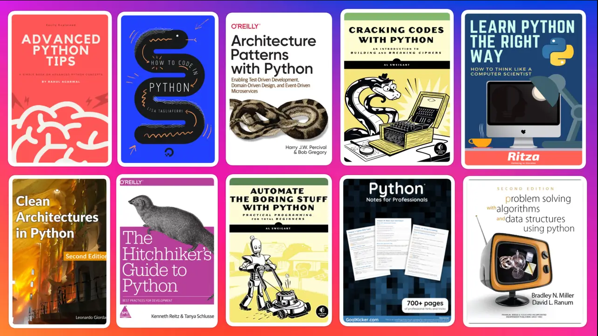

Nope. The main textbook that I used is available to read online for
free: Al Sweigart, [Automate the Boring Stuff with Python (4e)](https://automatetheboringstuff.com/) (2020),
there's also a course by the author [on Udemy ($12.99 until tomorrow)](https://www.udemy.com/course/automate/).

You could just read (a) book(s) to learn Python (that's what I do) but
you do need to put in the time to reflect, refactor and code anyway.

The Python online documentation recommends both [books](https://wiki.python.org/moin/PythonBooks) and [courses](https://wiki.python.org/moin/Courses).

**My typical workflow with programming books:**

1.  I start reading a book chapter (paper copy).
2.  I get antsy to try things out and throw the book away.
3.  I code on my own until my fingers bleed.
4.  I get lost and must return to the book.
5.  I vow to stay with the book and open the digital version.
6.  `continue` with (2). No `break`.
7.  Years later, I find the book in my library.
8.  I realize that my copy is completely out of date.
9.  I order the latest edition as paper and digital copy.
10. `continue` with (1).

# TODO Infinite skills

Image: [xkcd](https://www.explainxkcd.com/wiki/index.php/519:_11th_Grade) (Randall Munroe, robotics engineer at NASA)

> »&#x2026;And the ten minutes striking up a conversation with that strange
> kid in homeroom sometimes matters more than every other part of high
> school combined.«

-   **Infinite Skills**: come up with three programs you would create if you
    had "infinite programming skills" and if you could build anything
    you wanted **using a[ny] computer** and the **Python programming language**.

-   One example from everyone! Now!

# TODO Next / Any questions? / Review questions

 

-   Next up: Literate Python scripting infrastructure basics!

-   Before we go on:
    1.  What's the difference between "Python", "python3", and "IPython"?
        
        > -   "**Python**" is the name for the programming language
        > -   "**python3**" is the executable for Python's version 3
        > -   "**IPython**" is a Python shell or console for interactive
        >     computing, it's also the basis of Jupyter notebooks (Google
        >     Colab) and Jupyter lab (DataCamp workspace).
    2.  What's the difference between "IDLE", "Colab", "replit" and
        "DataCamp"?
        
        > -   "**IDLE**" (Interactive Development Learning Environment) is an IDE
        >     that comes with your Python installation (on Windows and macOS)
        >     and has a console + a file editor + a debugger.
        > -   "**Colab**" (Google Colaboratory) is an online interactive notebook
        >     (or "literary") development environment based on Jupyter lab.
        > -   "**replit**" (replit.com), named after REPL (Read-Eval-Print-Loop)
        >     is an online platform to learn many different languages, and it
        >     provides a file editor, a console and a shell.
    3.  Why are there so many **technical terms** (and lingo) around learning
        Python? I thought it was an easy language suited for beginners?
        
        
        
        > Python is supposedly easy for beginners but it is also part of a
        > huge, mixed commercial/open/free technological ecosystem, and as
        > a programming language it requires infrastructure (both hardware
        > and software), which changes continuously.
    4.  A **7-year old** asks you what you're doing while you're working on
        the **Python shell** to complete an assignment. What would you reply?

# TODO Practice: Python scripting infrastructure

([PDF and an Org-mode version of this exercise](https://github.com/birkenkrahe/py/) on GitHub)

Objectives:

-   Find Python on your computer
-   Find Python for download to your PC on the web
-   Starting and using Google Colab, IDLE, DataCamp and replit.com
-   Understand the "literate programming concept"
-   Understand when we're using Colab + IDLE + replit.com
-   Options for creating and running Python scripts
-   Creating and running our first ever Python script

# Glossary

<table border="2" cellspacing="0" cellpadding="6" rules="groups" frame="hsides">

<colgroup>
<col  class="org-left" />

<col  class="org-left" />
</colgroup>
<thead>
<tr>
<th scope="col" class="org-left">TERM</th>
<th scope="col" class="org-left">MEANING</th>
</tr>
</thead>

<tbody>
<tr>
<td class="org-left">Meta data</td>
<td class="org-left">Data about data (e.g. layout instructions)</td>
</tr>

<tr>
<td class="org-left">Infrastructure</td>
<td class="org-left">Computing roadworks: hardware and software</td>
</tr>

<tr>
<td class="org-left">Editor</td>
<td class="org-left">Program to write programs in</td>
</tr>

<tr>
<td class="org-left">Compiler</td>
<td class="org-left">Program to turn source into machine code</td>
</tr>

<tr>
<td class="org-left">Python</td>
<td class="org-left">High-level, procedural, OOP language</td>
</tr>

<tr>
<td class="org-left">Source code</td>
<td class="org-left">Code for humans to read and edit (<code>.c</code>)</td>
</tr>

<tr>
<td class="org-left">Machine code</td>
<td class="org-left">Code for machines to execute (<code>.exe</code>)</td>
</tr>

<tr>
<td class="org-left"><a href="https://en.wikipedia.org/wiki/Git">Git</a> (as in GitHub)</td>
<td class="org-left">Software version control system (2005)</td>
</tr>

<tr>
<td class="org-left"><a href="https://www.gnu.org/software/emacs/">Emacs</a></td>
<td class="org-left">Extensible editor written in Lisp (1985)</td>
</tr>

<tr>
<td class="org-left">FOSS</td>
<td class="org-left">Free and Open Source Software</td>
</tr>

<tr>
<td class="org-left">IDLE</td>
<td class="org-left">IDE bundled with Python</td>
</tr>

<tr>
<td class="org-left"><a href="https://en.wikipedia.org/wiki/Linux">Linux</a></td>
<td class="org-left">FOSS operating system (1991)</td>
</tr>

<tr>
<td class="org-left">Windows, MacOS</td>
<td class="org-left">Commercial OS (Microsoft, Apple)</td>
</tr>

<tr>
<td class="org-left">Command line</td>
<td class="org-left">Terminal, shell program to talk to the OS</td>
</tr>

<tr>
<td class="org-left">Prompt</td>
<td class="org-left">Location on your computer, e.g. <code>C:\User\</code></td>
</tr>

<tr>
<td class="org-left">Literate programming</td>
<td class="org-left">Doc + code + output for humans and machines</td>
</tr>
</tbody>
</table>

# References

-   Neary M (Nov 13, 2019). Getting Started With Python IDLE. URL:
    [realpython.com](https://realpython.com/python-idle/).
-   Real Python (Jan 20, 2022). What is Python IDLE and How to Use the
    IDLE Shell. URL: [youtube.com](https://youtu.be/WIlQukiXs-E).
-   Images (public domain/no known copyright restrictions):
    Unsplash.com, Flickr.com
-   PyCon (2020). Digging MUD in Python by Samuel Regandell. URL:
    [YouTube.com](https://youtu.be/WLfJ-zqMmuA).
-   Python 3.11.1. (Oct 24, 2022). Python Software Foundation. URL:
    [python.org](https://www.python.org/).

# Footnotes

<a id="fn.1" href="#fnr.1">1</a> As an alternative to Lisp (the original AI language and also
the first choice for MUD programming), you can use Python ([PyCon,
2020](https://youtu.be/WLfJ-zqMmuA)). Regarding the connection between Monty Python and MUD: see
the [mud scene from The Holy Grail](https://youtu.be/t2c-X8HiBng) (1975).

<a id="fn.2" href="#fnr.2">2</a> These lists are the answers of ChatGPT ([May 12 version](https://chat.openai.com/)). The
number of `*` indicate my level of agreement.
